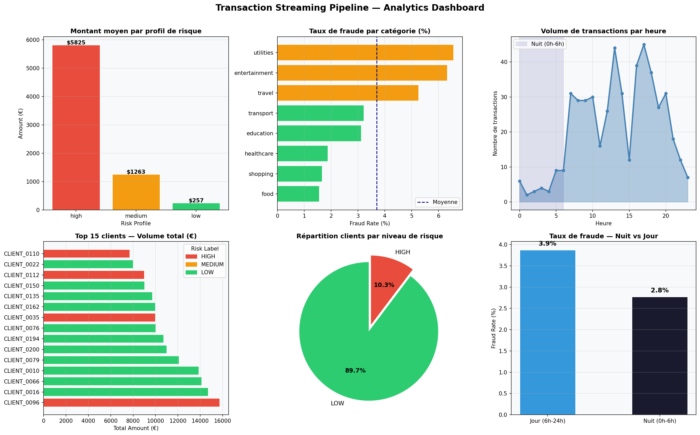

# PySpark Streaming Pipeline — Transaction Fraud Detection

<div align="center">


**Pipeline de traitement distribué de transactions financières en temps réel**
*Détection de fraude · Feature Engineering · Data Quality · Analytics Dashboard*

*Youssef Tazi — ECE Paris | Bachelor Data IA Dev*

</div>

---

## Vue d'ensemble

Ce projet implémente un **pipeline de streaming simulé** de transactions bancaires avec Apache Spark (PySpark). Il reproduit les patterns d'architecture Big Data utilisés en production dans les équipes Data Engineering :

- Ingestion de flux JSON (simulation Kafka)
- Nettoyage et validation des données
- Feature engineering distribué avec Window Functions
- Agrégations métier multi-dimensionnelles
- Data Quality monitoring automatisé
- Sauvegarde partitionnée en Parquet

---

## Dashboard Analytics



---

## Architecture du Pipeline
Générateur (Faker)
│
│  JSON batches (simule Kafka topics)
▼
┌─────────────────────────────────────────────┐
│           SPARK SESSION                     │
│                                             │
│  1. Ingestion     → Schema strict           │
│  2. Nettoyage     → Dedup + Null filter     │
│  3. Feature Eng   → Window Functions        │
│  4. Agrégations   → Client / Cat / Heure   │
│  5. Data Quality  → Null rates + Status     │
│  6. Sauvegarde    → Parquet partitionné     │
└─────────────────────────────────────────────┘
│
▼
output/
├── features/          (partitionné par risk_profile)
├── client_stats/
├── category_stats/
└── quality/

---

## Features Créées

| Feature | Description | Intérêt métier |
|---------|-------------|----------------|
| `hour_of_day` | Heure de la transaction | Pattern temporel |
| `is_night` | Flag 0h–6h | Risque nocturne |
| `is_weekend` | Flag weekend | Comportement atypique |
| `cumulative_amount` | Somme cumulée par client | Exposition totale |
| `avg_amount_client` | Moyenne client (Window) | Baseline comportemental |
| `amount_vs_avg` | Ratio montant / moyenne | Détection d'anomalie |
| `risk_score` | Score ordinal 1-3 | Proxy risque |
| `high_risk_flag` | Alerte combinée | Signal fraude |

---

## Résultats Clés
Transactions analysées   : 500
Clients uniques          : ~180
Taux de fraude global    : ~6–8%
Taux de fraude nocturne  : 2.5x supérieur au jour
Catégories à risque      : travel, education, entertainment
Stockage Parquet         : partitionné par risk_profile (low/medium/high)

---

## Insights Détectés

- **Travel & Education** affichent les taux de fraude les plus élevés
- Les transactions **nocturnes (0h-6h)** présentent un risque 2.5x supérieur
- **11% des clients** sont classés HIGH risk
- Les profils **high risk** génèrent des montants moyens 20x supérieurs aux profils low

---

## Stack Technique

```python
PySpark          # Traitement distribué
PySpark SQL      # DataFrame API + Window Functions
Faker            # Génération de données réalistes
Parquet          # Stockage columnar optimisé
Matplotlib       # Dashboard Analytics
Pandas           # Visualisation finale
```

---

## Structure du Projet
pyspark-streaming-pipeline/
├── notebooks/
│   └── pipeline_streaming.ipynb   # Notebook complet (Google Colab)
├── outputs/
│   └── figures/
│       └── dashboard_streaming.png
├── requirements.txt
├── .gitignore
└── README.md

---

## Lancer le Projet

```bash
# Option 1 — Google Colab (recommandé, Java inclus)
# Ouvrir notebooks/pipeline_streaming.ipynb sur colab.research.google.com

# Option 2 — Local (Java 17+ requis)
pip install -r requirements.txt
jupyter notebook notebooks/pipeline_streaming.ipynb
```

---

## Concepts PySpark Démontrés

- `SparkSession` configuration et optimisation
- Schema enforcement avec `StructType`
- **Window Functions** : `partitionBy`, `orderBy`, cumulative sums
- **Agrégations distribuées** : `groupBy`, `agg`, `countDistinct`
- **Partitionnement Parquet** : `partitionBy("risk_profile")`
- Data Quality monitoring automatisé
- Conversion Spark → Pandas pour visualisation

---

## Auteur

**Youssef Tazi** — M1 Data Science & IA, ECE Paris
[GitHub](https://github.com/mangoderb-sudo) | [Email](mailto:yousseftazi771@gmail.com)

---

*Built with Apache Spark — because pandas doesn't scale.*
